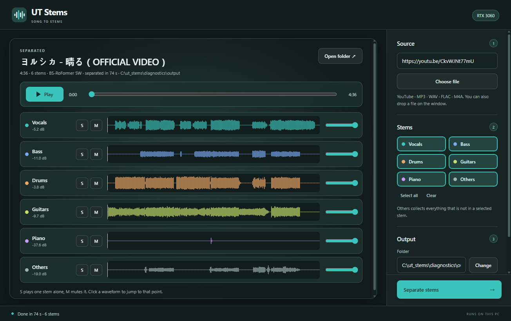

# UT Stems

Split a song into separate instrument tracks. Give it an audio file or a YouTube link and it writes
up to six MP3 stems: **vocals, bass, drums, guitars, piano, others**.

Everything runs on your own PC. It comes as a desktop app and as a command.



## What it does

- **Input**: an audio file (MP3, WAV, FLAC, M4A, anything ffmpeg reads) or a YouTube link.
  A link is downloaded as audio only and saved as `<title>.mp3` next to the stems.
- **Stems**: pick any of the six. `others` collects everything that is not in a selected stem, so
  with `others` selected the files always add up to the whole song. Without it, the rest is not written.
- **Output**: `<songname>_<instrument>.mp3` at 320 kbps, in the folder you choose.
- **Mixer** (desktop app): waveform, solo, mute and volume per stem, with synchronised playback.
  A stem with nothing in it is marked *silent*.

The default model is BS-RoFormer SW; HT-Demucs 6s is available as a faster alternative.
On an RTX 3060 a 4-minute song takes about a minute and uses under 4 GB of VRAM.

## Requirements

- Windows 10/11
- Python 3.10 or newer, on PATH
- An NVIDIA GPU (it also runs on CPU, much slower)
- ffmpeg on PATH: `winget install Gyan.FFmpeg`
- Node.js for the desktop window and for YouTube downloads: `winget install OpenJS.NodeJS.LTS`

## Setup

```
git clone https://github.com/zeberity123/ut_2_stems.git
cd ut_2_stems
setup.bat
```

`setup.bat` installs the Python packages into your default Python (no virtual environment), then
Electron. The first separation downloads the model checkpoint (about 670 MB) to
`%USERPROFILE%\.cache\bs-roformer-infer`.

## Use

### Desktop app

Double-click `run.bat`.

1. Paste a YouTube link, choose a file, or drop a file on the window.
2. Select the stems you want.
3. Choose the output folder and press **Separate stems**.

When it finishes, the stems open in the mixer and **Open folder** shows the files.

### Command line

The `ut-stems` command works from any folder.

```
ut-stems "song.mp3"
ut-stems "song.mp3" -o D:\stems
ut-stems "https://youtu.be/CkvWJNt77mU" --stems vocals,bass,drums,guitars
```

| Option | Meaning | Default |
|---|---|---|
| `-o`, `--out` | output folder | `./output` |
| `--stems` | comma-separated stems to write | all six |
| `--model` | `bs_roformer_sw` or `htdemucs_6s` | `bs_roformer_sw` |
| `--overlap` | `2`, `3` or `4`; higher is slower and slightly smoother | `2` |
| `--bitrate` | MP3 bitrate | `320k` |
| `--device` | `auto`, `cuda` or `cpu` | `auto` |

## How it is built

| Part | Where |
|---|---|
| Separation, YouTube download, MP3 I/O | `ut_stems/` (Python) |
| One pipeline shared by the app and the command | `ut_stems/pipeline.py` |
| Local server for the app (127.0.0.1, session token) | `ut_stems/server.py` |
| Interface | `web/` |
| Desktop shell | `desktop/` (Electron) |

The app structure and look follow [yt_to_score](https://github.com/zeberity123/yt_to_score); the
YouTube audio download follows [ut_downloader](https://github.com/zeberity123/ut_downloader).

## Tests

```
python -m pytest             fast tests, no model needed
python -m pytest -m slow     separation on a short clip, needs the GPU
npm run test:desktop         launches the app, separates a clip, checks the mixer
```

## Notes

- The BS-RoFormer SW checkpoint is a community release whose licence is listed as unknown on
  Hugging Face. It is downloaded at run time and is not part of this repository.
- Only download and separate music you have the right to use.
- `PLAN.md` records the model comparison and the decisions made along the way.
